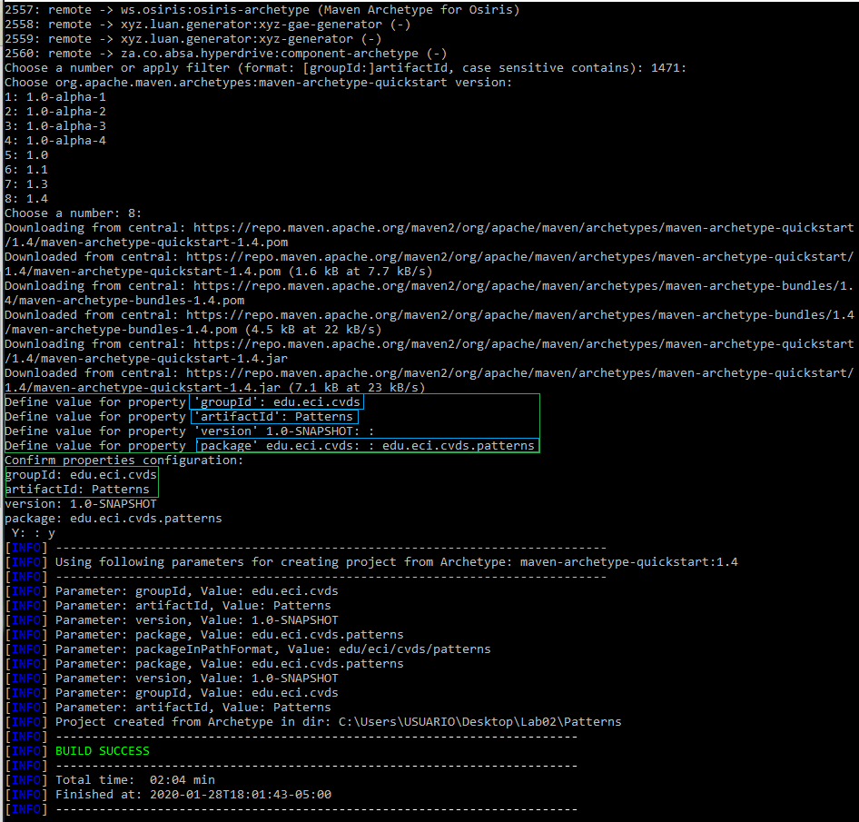
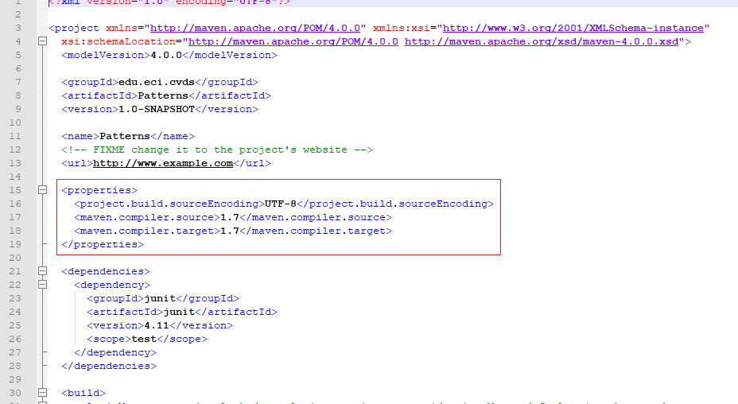
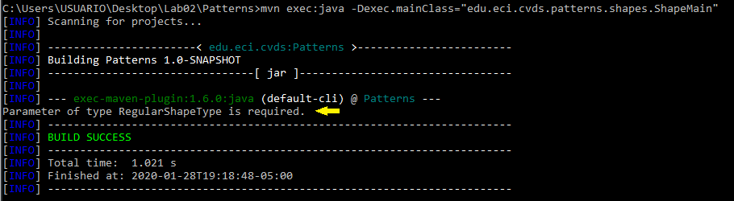
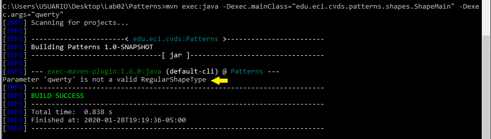
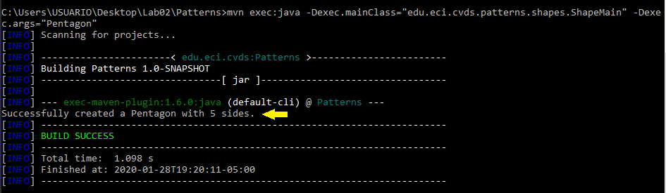
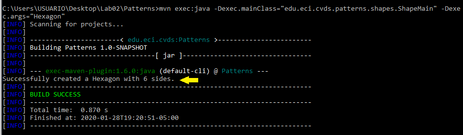

# Laboratorio No.2 (Patterns) #
### Laura A. Bernal Hernández ###
_____________________________________________________________

- **La Herramienta Maven**
	
	*Cuál es su mayor utilidad*
	>[Maven tiene la utilidad](http://panamahitek.com/que-es-maven-y-para-que-se-utiliza/) de gestión y construcción de software. 
	>Maven permite realizar tareas claramente definidas, como la compilación del código y su empaquetado. 
	>por lo tanto es posible la creación de software con dependencias incluidas. 
	>POM (Project Object Model) es un archivo en formato XML que contiene todo lo necesario para que a la hora
	>de generar el fichero ejecutable de nuestra aplicación este contenga todo lo que necesita para su ejecución.
	
	*Fases de maven*
	>
	>Una [fase en Maven](https://maven.apache.org/guides/introduction/introduction-to-the-lifecycle.html) representa una etapa del ciclo de vida de construccion y es responsable de una tarea.
	>
	>Validate (Verifica que un proyecto es correcto y que contiene toda la informacion)
	>
	>Compile (compliar el código)
	>
	>Test (Realiza prueba del codigo fuente)
	>
	>Package (Empaqueta el codigo en formato JAR)
	>
	>Verify (Verificacion de los resultados de las pruebas, esto garantiza los criteriso de calidad)
	>
	>Install (Instala el paquete, para poder ser usado como repositorio local)
	>
	>Deploy (Realiza la copia del paquete en un repositorio)
	>
	
	*Ciclo de vida de la construcción*
	>
	
	
	*Para qué sirven los plugins*
	>
	> Son los complementos de aplicacion del proyecto y este le permite añadir nuevas funciones al proyecto.
	>
	
	*Qué es y para qué sirve el repositorio central de maven*
	>
	> Maven me ofrece los servicios de ejecucion, y en union con github, me permite mantener al dia el proyecto en un estado correcto.
	>
	
- **Crear Un Proyecto Maven**

	>
	>
	>
	>
	>
	
- **Ajustar Algunas Configuraciones En El Proyecto**
	
	>
	>
	>
	>
	
- **Compilar y Ejecutar**
	
	
	
	
	
	
- **Hacer El Esqueleto De La Aplicacion**

	>
	>*¿Cuál(es) de las anteriores instrucciones se ejecutan y funcionan correctamente y por qué?*
	>
	> ***Sin parámetros***
	> Envia un mensaje donde solicita los parametros
	> 
	>
	> ***Parámetro: qwerty***
	> Envia un mensaje donde informa que es un parametro invalido
	> 
	>
	> ***Parámetro: pentagon***
	> Informa la cantidad de lados del Pentagono
	> 
	>
	> ***Parámetro Hexagon***
	>  Informa la cantidad de lados del Hexagono
	> 
	>
	
